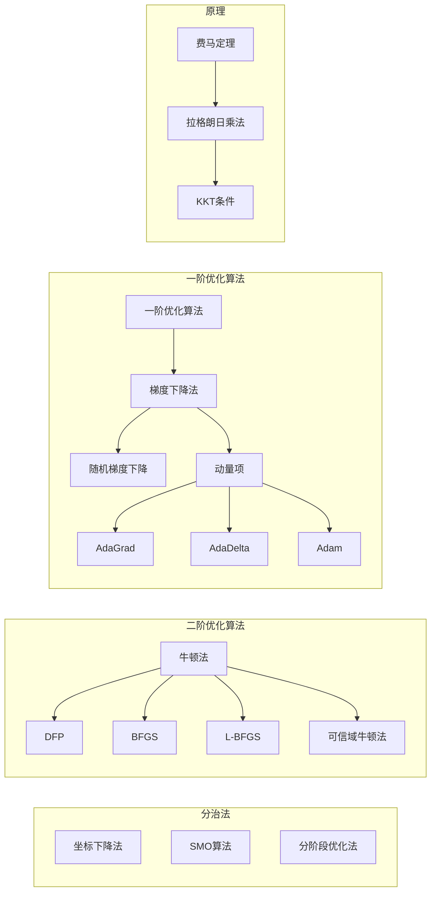

概论

资料：[最优化：建模、算法与理论](http://faculty.bicmr.pku.edu.cn/~wenzw/optbook/opt2.pdf)

## 优化问题
最优化问题一般可以描述为：
$$
min \quad f(x), \\
s.t. \quad x \in {X}
$$
其中$x = (x_1, \cdots, x_n)^T \in R^n$是决策变量， $f: R^n \rightarrow R$是目标函数， $X \in R^n$是约束集合或者可行域。$X =\{x \in R^n | c_i(x) \leq 0, i = 1, 2, \cdots, m. c_i(x) = 0, i = m + 1, \cdots, m + l\}$

最优化算法研究可以分为：构造最优化模型、确定优化问题的类型和设计算法、实现算法或调用优化算法软件包进行求解。

线性规划是指问题中目标函数和约束函数都是线性的，当目标函数和约束函数中至少有一个是非线性的，那么对应的优化问题称为非线性规划问题。

凸优化问题是指最小化问题中的目标函数和可行域函数是凸函数和凸集。

迭代算法的基本思想是从一个初始点出发基于给定规则进行有限次迭代得到一个点序列，最后一个点作为优化问题的解。如果迭代点列是无穷集合， 那么希望序列的极限点（或者聚点）为优化问题的解。 为了是算法能在有限步内终止，我们一般会设立一些收敛准则来保证迭代停在问题的一定精度的逼近解上。对于无约束优化问题，常用的收敛准则
$$
\frac{f(x^k) - f*}{max\{|f*|, 1\}}\leq \epsilon_1, ||\nabla f(x^k)|| \leq \epsilon_2
$$
$\epsilon_1, \epsilon_2$为很小的正数，$||\cdot||$表示某种范数。 $f*$为函数$f$的最小值。对于约束优化问题还需要考虑约束违反度。

在设计优化算法时， 我们有一些基本的准则或者技巧。对于复杂的优化问题，基本的想法是将其转化为一些列简单的优化问题来逐步求解。常用的技巧有：
- 泰勒展开。对于非线性的目标或者约束函数，我们通过其泰勒展开用简单的线性函数或者二次函数来逼近，从而得到一个简化的问题。
- 对偶问题：当原始问题比较难解时候，考虑拆成对偶问题来解
- 拆分：对于一个复杂的优化问题，可以考虑将一个变量拆分成若干变量并增加限制条件将其转化为简单问题
- 块坐标下降：对于一个n维空间的优化问题，可以通过逐步求解分量的方式将其转化为多个地位空间中的优化问题。比如对于n=100先固定2-100个分量求解$x_1$, 接着固定1,3-100来求解$x_2$, 以此类推。

## 优化问题的分类

> 费马定理：对于一个可导一元函数$y = f(x)$， 在极值点处导数必定为0。 对于
> - $f''(x) < 0 $， 该点为极大值
> - $f''(x) = 0 $， 需要看更高阶导数
> - $ f''(x) > 0$, 该点为极小值
> 对于多元函数，导数为0的点为驻点。对于
> - Hessian矩阵负定，函数在该点有极大值
> - Hessian矩阵不定，函数不是极值点
> - Hessian矩阵正定，函数在该点有极小值
需要注意，费马定理是个必要条件，而充分条件

> 拉格朗日乘子法：对于

id: e39063be01cd4e3284cf7d6ccecf5d58
parent_id: 107fb4b090644e53ba8f10cb30ec2978
created_time: 2023-07-13T07:20:37.857Z
updated_time: 2023-07-13T08:38:47.640Z
is_conflict: 0
latitude: 31.23041600
longitude: 121.47370100
altitude: 0.0000
author: 
source_url: 
is_todo: 0
todo_due: 0
todo_completed: 0
source: joplin-desktop
source_application: net.cozic.joplin-desktop
application_data: 
order: 0
user_created_time: 2023-07-13T07:20:37.857Z
user_updated_time: 2023-07-13T08:38:47.640Z
encryption_cipher_text: 
encryption_applied: 0
markup_language: 1
is_shared: 0
share_id: 
conflict_original_id: 
master_key_id: 
user_data: 
type_: 1