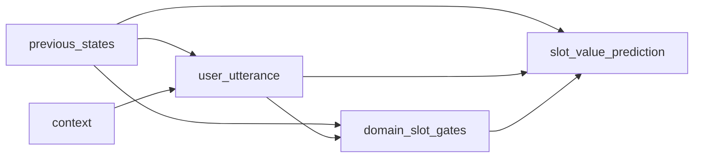

# A repo for storing materials in doing research of dialogue state tracking 
"DSTer" means the researchers on dialogue state tracking(DST). I use this repository to track my process of doing the research on DST and meanwhile, it can provide a limit support to other students, engineers, and researchers who are also interested in this topic. (If you are a new bee in this area, you can refer to the [survey](https://w.sentic.net/dialogue-systems-survey.pdf) which can be helpful in understanding the concepts of task-oriented dialogue systems)

I would like to split my work into three parts: 
1. collection of public datasets used to evaluate DST models and  the relative content are placed in the directory named "data". The objective of this part is to provide an unified access to the data when I found there are so many different settings adopted by existing methods in  aspect of data pre-process.
2. tracking powerful DST models according to my interest and understanding on the problem of dialogue state tracking; 
3. design and implementation of practical DST models

## Dialogue state tracking 
Dialogue state tracking, sometimes called belief tracking, refers to accurately estimating the user's goal as a dialog progresses. Accurate state tracking is desirable because it provides robustness to errors in speech recognition, and helps reduce ambiguity inherent in language within a temporal process like dialog.

I just want to develop my first version of DST tracker base on hugging face and transformer package. I can consult it's usage on [link0](https://huggingface.co/docs/datasets/quickstart), [link1](https://huggingface.co/docs/tokenizers/quicktour).

useful links:
- [Using Bert to implement name entity recognition](https://zhuanlan.zhihu.com/p/567920519)
- [Develop text CNN basd on Bert output](https://www.likecs.com/ask-3448006.html)

variable analysis based on intuition

- $P(user\_utterance | previous\_states, context)$
- $P(domain\_slot\_gates| previous\_state, user\_utterance)$
- $P(slot\_value|domain\_slot\_gate, user\_utterance)$

check influence of the sequence order of dialogue history
