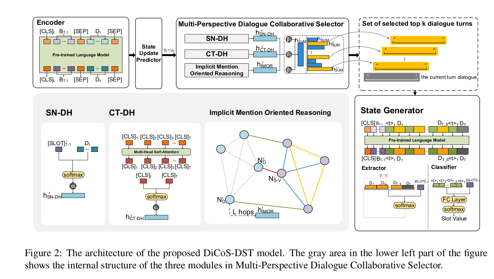
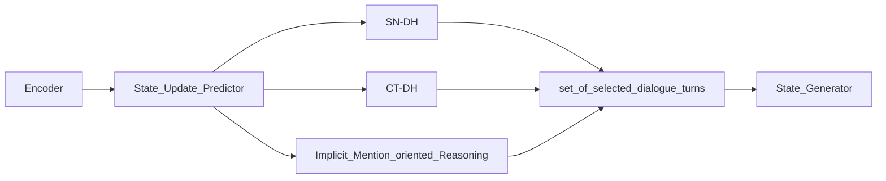

**Problem**: existing models use whole dialogue history for updating all dialogue state. The authors believe updating different slots in different turns requires different dialogue history, and using consistent dialogue contents leads to insufficiency or redundant information for different slots, which degrades the performance of dialogue state tracking models.

**Work**:  The authors devise DiCoS-DST to dynamically select the relevant dialogue contents to each slot for state tracking. The model evaluates the turn-level utterance of dialogue history from three perspective

- explicit connection to the slot name
- relevance to the current turn dialogue 
- implicit mention oriented reasoning
based on three types evaluation the model decides to select dialogue contents which are fed to state generator.

**experiment**
hyper-parameters setting:
- dropout: 0.1
- Language model: ALBERT-large-uncased model
- hidden size of encoder $d$: 1024
- optimizer: AdamW warmup proportion 0.01 and L2 weight decay of 0.01. 
- learning rate: the state update predictor the same as in DSS-DST 0.03 and of the other modules to 0.0001
- word dropout: 0.1
- GNN $L$: 3
- max sequence length for all inputs: 256

Actually, I found that this model is memory-hungry. It is not reproduce-friendly.

**Detail Information**: 

In DST, the definition of granularity ($g$ turns utterance before) is the number of dialogue turns spanning from a certain dialogue state in the dialogue to the current dialogue state.

For previous research, models set the granularity of all slots as a fixed number, i.e.,  $\text{granularity}(t, slot_i) = k,\; i =1,2,\cdots, n$, where $n$ denotes the number of all slots, $t$ represents the turns of dialogue and $k$ is a constant or hyper-parameter.  This paper proposes a model $\text{granularity}(t, slot_i) = k_i$.

there are three parts for modeling different perspectives consideration.

- (slot name,dialogue history,): devise an SN-DH module to touch on the relation of the dialogue history and the slot name, which directly reflects the relevance.
- (current turn, dialogue history): propose a CT-DH module to explore the dependency between each turn in the dialogue history and current turn dialogue
- (current_turn, co-references): propose an Implicit Mention Oriented Reasoning module to tackle the implicit mention(co-references) problems that commonly exists in complex dialogues.

the model can be represented as $P(turns) = P(turns| current\_turn, update\_gates, implict\_coreference)$

the process follows flow process:

Information encoding process: the authors employ the representation of the previous turn dialogue state $B_{T-1}$ concatenated to the representation of each turn dialogue utterances $D_t$ as input:
$$
E_t = [CLS]_t \oplus B_{T-1}\oplus [SEP]\oplus D_t(1\leq t \leq T)
$$
where $[CLS]_t$ is a special token added in front of every turn input. The representation of the previous turn dialogue state is $B_{T-1} = B_{T-1}^1\oplus \cdots \oplus B_{T-1}^J$. The representation of each slot's state $B_{T-1}^j = [SLOT]_{T-1}^j\oplus S_j\oplus [VALUE]_{T-1}^j \oplus V_{T-1}^j$, where $[SLOT]_{T-1}^j$ and $[VALUE]_{T-1}^j$ are special tokens that represent the slot name and the slot value at turn $T-1$. The representation of the dialogue at turn $t$ as $D_t = R_t\oplus;\oplus U_t [SEP]$, where $R_t$ is the system response and $U_t$ is the user utterance. Here ";" is a special token used to mark the boundary between $R_t$ and $U_t$, and $[SEP]$ is a special token used to mark the end of a dialogue turn.

**State Update predictor**: for all slot this module predicts relative gate to discern whether the slot should be updated or not.
$$
SUP(S_j) = \left\{
    \begin{array}{}
    update,& if\; Total\_score_j > \delta\\
    inherit,& otherwise
    \end{array}
\right .
$$
Let $U_s = {j|SUP(S_j) = update}$ be the set of the selected slot indices.
For each slot $S_j (j \in U_s)$ selected to be updated SN-DH, CT-DH, and Implicit mention oriented reasoning modules are proposed to evaluate dialogue relevance and aggregate representations from three perspectives. 

**Slot name - dialogue history(SN-DH)**: For slot $S_j$, the module takes the slot name presentation $[SLOT]_{T-1}^j$ as the attention to the $t$-th turn dialogue representation $D_t$. The output $\alpha_t^j = \text{softmax}(D_t([SLOT]_{T-1}^j)^T)$ represents the correlation between each position of $D_t$ and the $j$-th slot name at turn $t$. Finally, the module outputs the aggregated dialogue representation $h_{SN-DH}^j=(\alpha_t^j)D_t$.

**Current turn - dialogue history(CT-DH)**: this module builds a multi-head self-attention(MHSA) layer on top of the $[CLS]$ tokens generated from different turns of dialogue to enhance inter-turn interaction. The MHSA layer is defined as :
$$
head_i = Attention(QW_i^Q, KW_i^K, VW_i^V)\\
Multihead = (head_i \oplus ... \oplus head_n)W^O\\
I = MHSA([CLS]_1\oplus ... \oplus [CLS]_T)
$$
where $Q,K,V$ are linear projections from $[CLS]$ embeddings of each turn of dialogue, representing attention queries, key, and values.

Then the authors append an attention layer between output representation of the current turn dialogue and each turn of dialogue history to capture interactions between them:
$$
\gamma_t = Attention([CLS]_t, [CLS]_T)
h_{CT-DH}^t = \gamma_t[CLS]_T + [CLS]_t
$$

**Implicit Mention Oriented Reasoning**: taking into consideration of complex implicit mentions in dialogue, the authors build a graph neural network (GNN) model to explicitly facilitate reasoning over the turns of dialogue and all slot-value pairs for better exploitation of co-referential relation. 

- The nodes in the graph include two types: $N_D$ for each turn dialogue and $N_{S-V}$ for each slot-value pair. They are initialized with the MHSA output representaion $[CLS]_t$ and $W_{S-V}([SLOT]_{T-1}^z\oplus[VALUE]_{T-1}^z)(1\leq z \leq J)$ 
- The edges consist of four types
    - Add an edge between $N_{S-V}^j$ and $N_D^T$ (red line in figure). As aforementioned, the slot $S_j$ will be updated. This edge to establish the connection between the slot to be updated and the current turn dialogue;
    - Add an edge between $N_{S-V}^j$ and $N_{S-V}^z(z\neq j)$(blue line in figure). These edges are to establish connections between the slot to be updated and other slots
    - Add an edge between $N_{S-V}^z(z\neq j)$ and $N_D^{t_z}$, $t_z$ is the turn when the most up-to-date value of $S_z$ is updated(green line in figure). These edges are to establish connections between each slot and the turn of dialogue in which its latest slot value was updated;
    - Add an edge between $N_{S-V}^{z_1}$ and $N_{S-V}^{z_2} (z_1, z_2$ belong to the same domain)（yellow line in figure）. These edges are to establish connections between slots that belong to the same domain. 

the authors use multi-relational GCN with gating mechanism. Let $h_i^0$ represents initial node embedding form $N_D$ or $N_{S-V}$. The calculation of node embedding after one hop can be formulated as:
$$
h_i^{l+1} = \sigma(u_i^l) \odot g_i^l + h_i^l \odot (1-g_i^l)\\
u_i^l = f_s(h_i^l) + \sum_{r\in R}\frac{1}{|N_i^r|}\sum_{n\in N_i^r}f_r(h_n^l)\\
g_i^l = \text{sigmoid}(f_g([u_g^l; h_i^l]))
$$
$N_i^r$ is the neighbors of node $i$ with edge type $r$, $R$ is the set of all edge types, and $h_n^l$ is the node representation of node $n$ in layer $l$. Each of $f_r, f_s, f_g$ can be implemented with an MLP. Gate control $g_i^l$ is a vector consisting of values between 0 and 1 to control the amount information from computed update $u_i^l$ or from the original $h_i^l$. Function $\sigma$ denotes a non-linear activation function. After the message passes on the graph with $L$ hops, the final representaion of the $t$ th turn dialogue node $N_D^t$ as the aggregated representation $h_{IMOR}^t$ in this perspective.

**Gate Fusion and collaborative selection**: The representation $h_{SN-DH}^t, h_{CT-DH}^t, h_{IMOR}^t$ of $t$-th turn dialogue enter this module for fusion and ranking. 
$$
h_{sum}^t = \beta_1 h_{SN-DH}^t + \beta_2 h_{CT-DH} + \beta_3 h_{IMOR}^t\\
\beta_i = \sigma(W_{\beta_{i1}} \tanh(W_{\beta_{i2}} h_{\beta_i}^t))
$$
where $h_{\beta_{i}}^t$ is relative hidden state of $D_t$.

**State Generator**： After getting a selected dialogue set $U_D$, the author concatenate these dialogue utterances together to form a new input sequence $C = [CLS] \oplus B_{T-1} \oplus <t>_1\oplus D_1\oplus\cdots\oplus <t>_{T\_S}\oplus D_{T\_S}\oplus <T>_T\oplus D_T(T\_S = |U_D|)$

Here the author inject an indicator token "$<t>$" before each turn of dialogue utterance to get aggregated turn embeddins for the subsequent classification-based state prediction.

- Slot Value Generation (span prediction):  using the extractive method from representaion $C_E = D_1 \oplus D_2 \oplus ...\oplus D_{T\_S}\oplus D_T$:
    $$
    p = \text{softmax}(W_sC_E [SLOT]_{T-1}^j)^T)\\
    q = \text{softmax}(W_eC_E [SLOT]_{T-1}^j)^T)
    $$
    the span of $<p,q>$ is taken as the prediction. If this prediction does not belone to the candidate value set of $S_j$, the model use the representation of $C_C = <t>_1 \oplus ... \oplus <t>_{T\S} \oplus <t>_T$ to get the distribution and choose the candidate slot value corresponding to the maximum value 
    $$
    y = \text{softmax} (W_CC_C([SLOT]_{T-1}^j)^T)
    $$

The training objectives of two methods as cross-entropy loss:
$$
L_{ext} = -\frac{1}{|U_s|}\sum_j^{|U_s}(p\log \hat p + q\log \hat q)\\
L_{cls} = -\frac{1}{U_s}\sum_j^{|U_s|}y\log \hat y
$$

