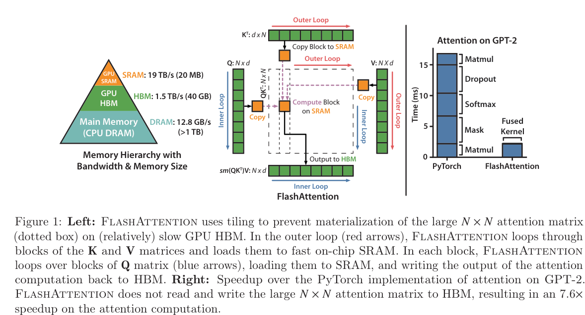

# Problem
Transformers are slow and memory-hungry on long sequences. Existing approximate attention methods often do not achieve wall-clock speedup.

# Work
The authors argue that a missing principle is making attention algorithms IO-aware—accounting for reads and writes between levels of GPU memory, and propose FlashAttention, an IO-aware exact attention algorithm that uses tiling to reduce the number of memory reads/writes between GPU high bandwidth memory (HBM) and GPU on-chip SRAM.

codes:  https://github.com/HazyResearch/flash-attention

## advantages
- Faster model training
- higher quality models
- Benchmarking attention

## details
Given input sequences $Q,K,V \in R^{N\times d}$, where $N$ is the sequence length and $d$ is the head dimension
### Standard attention implementation
the attention output $O\in R^{N\times d}$:
$$
S=QK^T \in R^{N \times N},\quad P = \text{softmax}(S) \in R^{N \times N}, \quad O = P V \in R^{N \times d}
$$

### FlashAttention

- Tiling: For numerical stability, the softmax of vector $x\in R^B$ is computed as:
  $$
  m(x):=\max_i x_i, \; f(x):= [e^{x_1 - m(x)}\cdots e^{x_B - m(x)}]\\
  l(x) := \sum_i f(x)_i\quad \text{softmax}(x) := \frac{f(x)}{l(x)}
  $$
  For vectors $x^{(1)}, x^{(2)} \in R^B$, we can decompose the softmax of the concatenated $x=[x^{(1)} x^{(2)}] \in R^{2B}$ as :
  $$
  m(x) = m([x^{(1)} x^{(2)}])= \max(m(x^{(1)}), m(x^{(2)}))\\
  l(x) = l([x^{(1)} x^{(2)}])= e^{m(x^{(1)}) - m(x)}l(x^{(1)}) + e^{m(x^{(2)}) - m(x)}l(x^{(2)})\\
  \text{softmax}(x) = \frac{f(x)}{l(x)}
  $$
