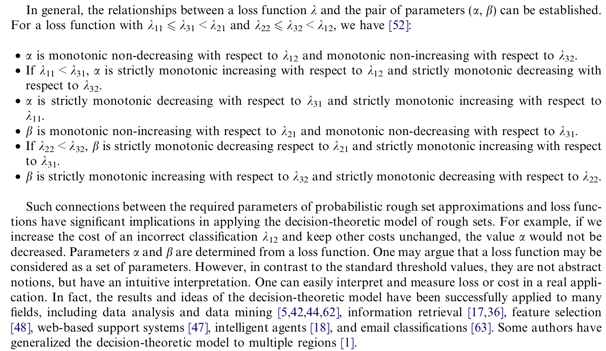

## Problem

A fundamental difficulty with the probabilistic and parameterized approximations is the physical interpretation and systematic method for setting of the required threshold parameters. Here the author firstly reviews the bayes decision theory and provides an alternative answer to above questions.

## Details

Bayesian decision procedure deals mainly with making decision with minimum risk or cost under probabilistic uncertainty. 

### Bayes decision procedure

Let $\Omega = \{w_1, w_2, \cdots, w_s\}$ be a finite set of states $s$, and $A = \{a_1, \cdots, a_m\}$ be a finite set of $m$ possible actions. Let $P(w_j|x)$ be the conditional probability of an object $x$ being in state $w_j$ given that the object is described by $x$.  Without the loss of generality, we simply assume that these conditional probabilities $P(w_j|x)$ are known.

Let $\lambda (a_i|w_j)$ denote the loss or cost for taking action $a_i$ when the state is $w_j$. For an object with description $x$, suppose action $a_i$ is taken. Since $P(w_j|x)$ is the probability that the true state is $w_j$ given $x$, the expected loss associated with taking action $a_i$ is given by 
$$
R(a_i|x) = \sum_{j=1}^s \lambda (a_i|w_j)P(w_j|x)
$$
the quantity $R(a_i|x)$ is also called the conditional risk. Given description $x$, a decision rule is a function $\tau(x)$ that specifies which action to take. The overall risk $R$ is the expected loss associated with a given decision rule. Since $R(\tau(x)|x)$ is the conditional risk associated with action $\tau(x)$, the overall risk is defined by $R = \sum_x R(\tau(x)|x) P(x)$.

The Bayesian decision procedure can be stated as follows. For every $x$, compute the conditional risk $R(a_i|x)$ for $i=1,\cdots m$ , and then select the action for which the conditional risk is minimum. If more than one action minimizes $R(a_i|x)$, any tie-breaking rule can be used.

### probabilistic rough set approximations

In an approximation space $apr = (U,E)$, all elements in the equivalence class $[x]$ share the same description.  For a given subset $A \subseteq U$, the approximation operators partition the universe into three disjoint classes $POS(A), NEG(A)$ and $BND(A)$.  Furthermore, one decides how to assign $x$ into the three regions based on  the conditional probability $P(A|[x])$ . 

For deriving the probabilistic approximation operators, we have the following problem. The set of states is given by $\Omega=\{A, A^c\}$ indicating that an element is in $A$ and not in $A$, respectively.  We use the same symbol to denote both a subset $A$ and the corresponding state. With respect to three regions , the set of actions is given by $A=\{a_1, a_2, a_3\}$, where $a_1, a_2, a_3$ represent the three actions in classifying an object, namely, deciding $POS(A), BND(A), NEG(A)$.

Let $\lambda(a_i|A)$ denote the loss incurred for taking action $a_i$ when an object in fact belongs to $A$, and let $\lambda(a_i|A^c)$ denote the loss incurred for taking the same actions when  the object does not belong to $A$. The rough membership values $\mu_A(x)=P(A|[x])$ and $\mu_{A^c}(x) = 1 - P(A^c|[x])$ are the probabilities that an object in the equivalence class $[x]$ belongs to $A$ and $A^c$.  The expected loss $R(a_i|[x])$ associated with taking the individual actions can be expressed as 

$$
R(a_1|[x]) = \lambda_{11} P(A|[x]) + \lambda_{12}P(A^c|[x])\\
=(\lambda_{11} - \lambda_{12})P(A|[x]) + \lambda_{12}\\
R(a_2|[x]) = \lambda_{21}P(A|[x]) + \lambda_{22}P(A^c|[x])\\ 
=(\lambda_{21} - \lambda_{22})P(A|[x]) + \lambda_{22}\\ 
R(a_3|[x]) = \lambda_{31} P(A|[x]) + \lambda_{32}P(A^c|[x])\\ 
=(\lambda_{31} - \lambda_{32})P(A|[x]) + \lambda_{32} 
$$

where $\lambda_{i1} = \lambda(a_i|A), \lambda_{i2} = \lambda(a_i|A^c)$, and $i=1,2,3$.  The bayesian decision procedure leads to the following minimum-risk decision rules:

- P: If $R(a_1|[x]) \leq R(a_2|[x])$ and $R(a_1|[x]) \leq R(a_3|[x])$, decide $POS(A)$
    $$
    [(\lambda_{11} - \lambda_{12}) - (\lambda_{21} - \lambda_{22})]P(A|[x]) \leq \lambda_{22} - \lambda_{12}\\
    \Rightarrow [(\lambda_{21} - \lambda_{11}) + (\lambda_{12} - \lambda_{22})]P(A|[x]) \geq \lambda_{12} - \lambda_{22}\\
    [(\lambda_{11} - \lambda_{12}) - (\lambda_{31} - \lambda_{32})]P(A|[x]) \leq \lambda_{32} - \lambda_{12}\\
    \Rightarrow [(\lambda_{31} - \lambda_{11}) + (\lambda_{12} - \lambda_{32})]P(A|[x]) \geq \lambda_{12} - \lambda_{32}
    $$

- N: If $R(a_2|[x]) \leq R(a_1|[x])$ and $R(a_2|[x]) \leq R(a_3|[x])$ decide $NEG(A)$
    $$
    [(\lambda_{21} - \lambda_{11}) + (\lambda_{12} - \lambda_{22})]P(A|[x]) \leq \lambda_{12} - \lambda_{22}\\
    [(\lambda_{21} - \lambda_{31}) + (\lambda_{32} - \lambda_{22})]P(A|[x]) \leq \lambda_{32} - \lambda_{22}
    $$

- B: If $R(a_3|[x]) \leq R(a_1|[x])$ and $R(a_3|[x]) \leq R(a_2|[x])$ decide $BND(A)$
    $$
    [(\lambda_{31} - \lambda_{32}) - (\lambda_{11} - \lambda_{12})]P(A|[x]) \leq \lambda_{12} - \lambda_{32} \\
    [(\lambda_{21} - \lambda_{31}) + (\lambda_{32} - \lambda_{22})] P(A|[x]) \geq \lambda_{22} - \lambda_{32}
    $$
    
Assuming that the risk factors satisfies $\lambda_{11} \leq \lambda_{31} < \lambda_{21} [POS(A) \leq BND(A) < NEG(A)]$, $\lambda _{22} \leq \lambda_{32} < \lambda_{12}$ and $(\lambda_{12} - \lambda_{32})(\lambda_{21} - \lambda_{31}) \geq (\lambda_{31} - \lambda_{11})(\lambda_{32} - \lambda_{22})$, we can get:

- $POS(A)$ 
    $$
    P(A|[x]) \geq \gamma = \frac{\lambda_{12} - \lambda_{22}}{(\lambda_{21} - \lambda_{11}) + (\lambda_{12} - \lambda_{22})}\\
    P(A|[x]) \geq \alpha = \frac{\lambda_{12} - \lambda_{32}}{(\lambda_{31} - \lambda_{11}) + (\lambda_{12} - \lambda_{32})}
    $$

- $NEG(A)$: 
    $$
    P(A|[x]) \leq \gamma = \frac{\lambda_{12} - \lambda_{22}}{(\lambda_{21} - \lambda_{11}) + (\lambda_{12} - \lambda_{22})}\\
    P(A|[x]) \leq \beta = \frac{\lambda_{32} - \lambda_{22}}{(\lambda_{21} - \lambda_{31}) + (\lambda_{32} - \lambda_{22})}
    $$

- $BND(A)$:
    $$
    P(A|[x]) \leq \alpha = \frac{\lambda_{12} - \lambda_{32}}{(\lambda_{31} - \lambda_{11}) + (\lambda_{12} - \lambda_{32})}\\
    P(A|[x]) \geq \beta = \frac{\lambda_{32} - \lambda_{22}}{(\lambda_{21} - \lambda_{31}) + (\lambda_{32} - \lambda_{22})}
    $$

The implicit assumption:

$$
\lambda_{11} < \lambda_{12}; \quad \lambda_{32} < \lambda_{31}\\

\\
\lambda_{11} \leq \lambda_{31} < \lambda_{21}
\\
\lambda _{22} \leq \lambda_{32} < \lambda_{12}
$$

To make $\alpha \leq \gamma \leq \beta$ , the condition $(\lambda_{12} - \lambda_{32})(\lambda_{21} - \lambda_{31}) \geq (\lambda_{31} - \lambda_{11})(\lambda_{32} - \lambda_{22})$ is assumed.  The physical meaning of condition may be interpreted as follows. 
$$
\alpha \leq \gamma\\
\frac{\lambda_{12} - \lambda_{22}}{(\lambda_{21} - \lambda_{11}) + (\lambda_{12} - \lambda_{22})} 
\geq 
\frac{\lambda_{12} - \lambda_{32}}{(\lambda_{31} - \lambda_{11}) + (\lambda_{12} - \lambda_{32})}\\
(\lambda_{12} - \lambda_{22})[(\lambda_{31} - \lambda_{11}) + (\lambda_{12} - \lambda_{32})] 
\geq
(\lambda_{12} - \lambda_{32})[(\lambda_{21} - \lambda_{11}) + (\lambda_{12} - \lambda_{22})]
\\
\Rightarrow \lambda_{32}[(\lambda_{21} - \lambda_{11}) + (\lambda_{12} - \lambda_{22})] - \lambda_{22}[(\lambda_{31} - \lambda_{11}) + (\lambda_{12} - \lambda_{32})] \\
\geq 
\lambda_{12}[\lambda_{21} - \lambda_{22} - \lambda_{31} + \lambda_{32}]
$$

Let $l=(\lambda_{12} - \lambda_{32})(\lambda_{21} - \lambda_{31})$ and $r=(\lambda_{31} - \lambda_{11})(\lambda_{32} - \lambda_{22})$. While $l$ is the product of the differences between **the cost of making an incorrect classification** and **cost of classifying an element into the boundary region**, $r$ is the product of the differences between **the cost of classifying an element into the boundary region** and **the cost of a correct classification**. 

In fact, the condition can be intuitively interpreted as saying that cost of classifying an element into the boundary region is closer to the cost of a correct classification than to the cost of an incorrect classification.

<<<<<<< HEAD
Actually, I think there is some vague details in this paper, to solve this problem, I write a little material to interpret the philosophy of probabilistic rough sets. you can read it at [here](./_resource/probabilistic rough set approximation.pdf)
=======

### Reflection
Actually, I think that original paper has not answer such a question: why should we adopt three-way decision from the perspective of optimization. Now here I just try to give an alternative reply.
If we adopt original two-way decision, then the loss should be:
$$
R(a_1|[x]) = \lambda_{11}P(A|[x]) + \lambda_{12}P(A^c|[x]) \\
=(\lambda_{11} - \lambda_{12})P(A|[x]) + \lambda_{12} \\

R(a_2|[x]) = \lambda_{21}P(A|[x]) + \lambda_{22}P(A^c|[x]) \\
=(\lambda_{21} - \lambda_{22})P(A|[x]) + \lambda_{22} \\
$$ 

In fact, there are two situations as follows:
$$

(\lambda_{11} - \lambda_{12})P(A|[x]) + \lambda_{12} \leq (\lambda_{21} - \lambda_{22})P(A|[x]) + \lambda_{22}\\

[(\lambda_{11} - \lambda_{12}) - (\lambda_{21} - \lambda_{22})]P(A|[x]) \leq \lambda_{22} - \lambda_{12}\\

[(\lambda_{11} - \lambda_{21}) + ( \lambda_{22} - \lambda_{12})]P(A|[x]) \leq \lambda_{22} - \lambda_{12}\\

(\lambda_{11} - \lambda_{12})P(A|[x]) + \lambda_{12} \geq (\lambda_{21} - \lambda_{22})P(A|[x]) + \lambda_{22}

\\

$$
>>>>>>> 14444f8 (skip)
