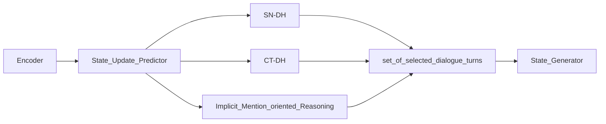

**Problem**: existing models use whole dialogue history for updating all dialogue state. The authors believe updating different slots in different turns requires different dialogue history, and using consistent dialogue contents leads to insufficiency or redundant information for different slots, which degrades the performance of dialogue state tracking models.

**Work**:  The authors devise DiCoS-DST to dynamically select the relevant dialogue contents to each slot for state tracking. The model evaluates the turn-level utterance of dialogue history from three perspective

- explicit connection to the slot name
- relevance to the current turn dialogue 
- implicit mention oriented reasoning

based on three types evaluation the model decides to select dialogue contents which are fed to state generator.

**Detail Information**: 

In DST, the definition of granularity ($g$ turns utterance before) is the number of dialogue turns spanning from a certain dialogue state in the dialogue to the current dialogue state.

For previous research, models set the granularity of all slots as a fixed number, i.e.,  $\text{granularity}(t, slot_i) = k,\; i =1,2,\cdots, n$, where $n$ denotes the number of all slots, $t$ represents the turns of dialogue and $k$ is a constant or hyper-parameter.  This paper proposes a model $\text{granularity}(t, slot_i) = k_i$.

there are three parts for modeling different perspectives consideration.

- (slot name,dialogue history,): devise an SN-DH module to touch on the relation of the dialogue history and the slot name, which directly reflects the relevance.
- (current turn, dialogue history): propose a CT-DH module to explore the dependency between each turn in the dialogue history and current turn dialogue
- (current_turn, co-references): propose an Implicit Mention Oriented Reasoning module to tackle the implicit mention(co-references) problems that commonly exists in complex dialogues.

the model can be represented as $P(turns) = P(turns| current\_turn, update\_gates, implict\_coreference)$

the process follows flow process:

Information encoding process: the authors employ the representation of the previous turn dialogue state $B_{T-1}$ concatenated to the representation of each turn dialogue utterances $D_t$ as input:
$$
E_t = [CLS]_t \oplus B_{T-1}\oplus [SEP]\oplus D_t(1\leq t \leq T)
$$
where $[CLS]_t$ is a special token added in front of every turn input. The representation of the previous turn dialogue state is $B_{T-1} = B_{T-1}^1\oplus \cdots \oplus B_{T-1}^J$. The representation of each slot's state $B_{T-1}^j = [SLOT]_{T-1}^j\oplus S_j\oplus [VALUE]_{T-1}^j \oplus V_{T-1}^j$, where $[SLOT]_{T-1}^j$ and $[VALUE]_{T-1}^j$ are special tokens that represent the slot name and the slot value at turn $T-1$. The representation of the dialogue at turn $t$ as $D_t = R_t\oplus;\oplus U_t [SEP]$, where $R_t$ is the system response and $U_t$ is the user utterance. Here ";" is a special token used to mark the boundary between $R_t$ and $U_t$, and $[SEP]$ is a special token used to mark the end of a dialogue turn.

SN-DH:

To Be Continue
